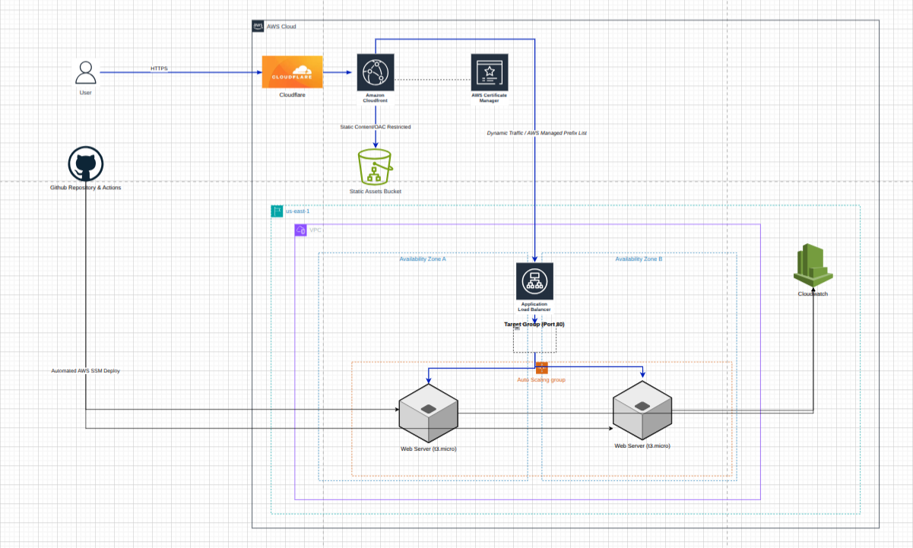

# ☁️ End-to-End AWS Cloud Architecture (Group 3)

Welcome to the **Group 3 Capstone Project**! This repository holds the code and documentation for a highly available, secure, and fully automated web application deployed on AWS. 

We built this project to demonstrate how to deploy a modern cloud infrastructure using **enterprise-grade security** and **automated CI/CD pipelines** while staying within the AWS Free Tier. 

If you are a junior engineer looking to replicate a real-world cloud deployment, you are in the right place. Follow this guide step-by-step!

---

## 🏗️ Architecture Overview

Our architecture separates the computing layer (EC2) from the static asset delivery layer (S3) and protects everything behind a global CDN (CloudFront). 

### **How the Traffic Flows:**
1. A user visits `https://cloud.badexhq.com`.
2. **Cloudflare (DNS)** securely routes the request to **Amazon CloudFront**.
3. **CloudFront (CDN)** acts as the smart router:
   - If the user asks for images, CSS, or JS files, CloudFront fetches them directly from a private **Amazon S3** bucket using Origin Access Control (OAC).
   - If the user asks for the HTML page, CloudFront forwards the request to the **Application Load Balancer (ALB)**.
4. The **ALB** routes the traffic to healthy **EC2 Instances** sitting inside an **Auto Scaling Group**.
5. When developers push new code to the `main` branch, **GitHub Actions** uses AWS Systems Manager (SSM) to automatically deploy the code to all running instances without needing SSH!

---

## 🛠️ The Tech Stack

* **Compute:** Amazon EC2, Auto Scaling Groups (ASG), Application Load Balancer (ALB)
* **Storage & CDN:** Amazon S3, Amazon CloudFront
* **Security & Identity:** AWS IAM, AWS Certificate Manager (ACM), Security Group Prefix Lists, Origin Access Control (OAC)
* **CI/CD & Automation:** GitHub Actions, AWS Systems Manager (SSM), Bash User Data Scripts
* **Monitoring & Cost:** Amazon CloudWatch (Logs & Alarms), AWS Budgets
* **DNS:** Cloudflare

---

## 🚀 Step-by-Step Replication Guide

### **Phase 1: The Foundation**
1. **Set up AWS & IAM:** Create an AWS account and set up IAM users with Administrator access (never use the Root account for daily tasks).
2. **Create the S3 Bucket:** Create an S3 bucket to hold static assets. *Keep it private.*
3. **Request an SSL Certificate:** Go to AWS Certificate Manager (ACM) in the **N. Virginia (`us-east-1`)** region. Request a public certificate for your domain and validate it using your DNS provider (e.g., Cloudflare).

### **Phase 2: The Core Application**
1. **The Launch Template:** Create an EC2 Launch Template using Amazon Linux 2023. Add a **User Data script** that automatically installs Apache (`httpd`), installs Git, and clones your repository into `/var/www/html/`.
2. **The Target Group:** Create a Target Group (Port 80) to monitor the health of your servers.
3. **The Load Balancer (ALB):** Create an Application Load Balancer facing the internet, listening on Port 80, and forwarding traffic to your Target Group.
4. **The Auto Scaling Group (ASG):** Create an ASG using your Launch Template. Attach it to your existing Load Balancer and set your desired capacity (e.g., 2 instances).

### **Phase 3: The Security Fortress (Hardening)**
1. **Set up CloudFront:** Create a CloudFront distribution. Point the default origin to your ALB, and set it to **Redirect HTTP to HTTPS**. Attach your ACM SSL certificate.
2. **Lock Down S3 (OAC):** Add your S3 bucket as a second origin in CloudFront. Enable **Origin Access Control (OAC)**. Update your S3 bucket policy so *only* CloudFront is allowed to read the files.
3. **Create Routing Behaviors:** In CloudFront, add behaviors for `*.css`, `*.js`, and `*.png` so they fetch from S3 instead of the ALB.
4. **Lock Down the ALB:** Edit the Security Group for your ALB. Delete the `0.0.0.0/0` rule and replace it with the **CloudFront AWS-Managed Prefix List**. Now, your ALB ignores the public internet and only accepts traffic from CloudFront.

### **Phase 4: CI/CD & Observability**
1. **Ditch SSH for SSM:** Create an IAM Role for your EC2 instances with `AmazonSSMManagedInstanceCore` permissions. Attach this role to your Launch Template so GitHub can securely deploy code without needing Port 22 open.
2. **GitHub Actions:** Add your AWS Access Keys to GitHub Secrets. Create a `.github/workflows/deploy.yml` file that uses `aws ssm send-command` to force all EC2 instances to run `git pull` whenever code is pushed to `main`.
3. **CloudWatch Logs:** Add the CloudWatch Agent installation to your EC2 User Data script so it pushes Apache access and error logs to AWS. Set the log retention to 7 days.
4. **CloudWatch Alarms:** Set up alarms to notify you via email if CPU Utilization goes over 80% or if the ALB throws 5xx errors.
5. **AWS Budgets:** Set a $0 Spend alert in AWS Budgets so you get an email the second your Free Tier limits are approached.

---

## ✅ Testing the Pipeline

To verify everything is working:
1. Make a small visual change to `index.html` on your local machine.
2. Commit and push the change to the `main` branch.
3. Watch the GitHub Actions tab. Once the pipeline turns green, AWS SSM has successfully pulled your code to all active EC2 instances.
4. Refresh your public domain (`https://cloud.yourdomain.com`). You will see the update instantly, served securely over HTTPS!

---

## 👥 Contributors (Group 3)

* **Tijani:** IAM Security, GitHub Organization, CloudWatch Logging & Peer Review.
* **Manu (Lead):** Core Architecture, Application Development, Target Groups, ASG configuration & AWS Budgets.
* **Freda:** EC2 Provisioning, Shell Scripting, CI/CD Pipeline (GitHub Actions) & SSM Integration.
* **Caleb:** Global DNS (Cloudflare), CloudFront CDN, ACM SSL Certificates & Architecture Diagramming.

*Built with ❤️ for the Cloud Engineering Capstone.*
